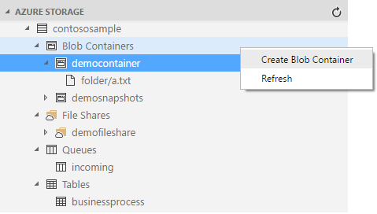
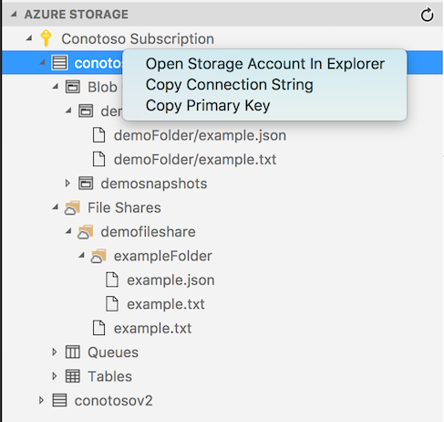
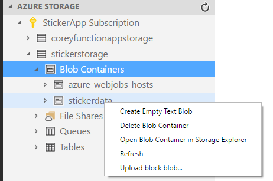
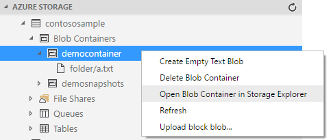

# Azure Storage for Visual Studio Code (Preview)
The Azure Storage extension for VS Code lets you browse Azure Blob Containers, File Shares, Tables, and Queues.

## Features
* Explore/Create/Delete Blob Containers, File Shares, Queues and Tables

   
   

 * Access Connection String and Primary Key

   

 * Create/Edit/Delete Block Blobs and Files

   

 * Open in Storage Explorer for memory or computationally heavy tasks, or for upload/download of large or non-text files.

   

## Extension Settings

* `azureStorage.showExplorer`: Set to `false` to hide Azure Storage Explorer
* `azureStorage.storageExplorerLocation`: Set to `"Path/To/Microsoft Azure Storage Explorer.app"` to override the default location.
* `azureStorage.file.showSavePrompt`: Set to `false` to prevent showing a warning dialog on File file save.
* `azureStorage.blob.showSavePrompt`: Set to `false` to prevent showing a warning dialog on Blob file save.

## Known Issues

- Classic Storage Accounts not supported.

## Contributing

This project welcomes contributions and suggestions.  Most contributions require you to agree to a
Contributor License Agreement (CLA) declaring that you have the right to, and actually do, grant us
the rights to use your contribution. For details, visit https://cla.microsoft.com.

When you submit a pull request, a CLA-bot will automatically determine whether you need to provide
a CLA and decorate the PR appropriately (e.g., label, comment). Simply follow the instructions
provided by the bot. You will only need to do this once across all repos using our CLA.

This project has adopted the [Microsoft Open Source Code of Conduct](https://opensource.microsoft.com/codeofconduct/).
For more information see the [Code of Conduct FAQ](https://opensource.microsoft.com/codeofconduct/faq/) or
contact [opencode@microsoft.com](mailto:opencode@microsoft.com) with any additional questions or comments.

## Telemetry
VS Code collects usage data and sends it to Microsoft to help improve our products and services. Read our [privacy statement](https://go.microsoft.com/fwlink/?LinkID=528096&clcid=0x409) to learn more. If you don’t wish to send usage data to Microsoft, you can set the `telemetry.enableTelemetry` setting to `false`. Learn more in our [FAQ](https://code.visualstudio.com/docs/supporting/faq#_how-to-disable-telemetry-reporting).
